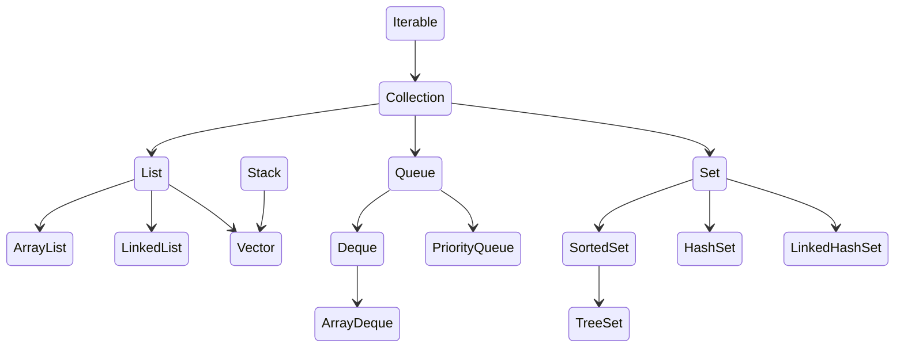

### 1 what is collection in java?
* A collection is a framework that provides an architecture for storing and 
manipulating a collection of objects.
* collection framework are capable of doing any data operation such 
as seraching, sorting, insertion, manipulation and deletion

### HashSet vs TreeSet
| Feature        | HashSet     | TreeSet             |
|:---------------|:------------|:--------------------|
| Implementation | HashTable   | Red-black tree      |
| Ordering       | No order    | Sorted Ascending    |
| Null Support   | allows null | Does not allow null |
| Speed          | faster      | Slower              |

### Collection framework


### Iterable Interface:
* This collection framework primary interface. is extended by the collection interface
* main purpose is to provide an iterator for the collection.
* this interface only has one abstract method, the iterator.

### Collection Interface
* the Collection interface is the root interface of Java collections
* Collection interface represents
  * it represents a group of elements and defines operation like
    * add
    * remove
    * iterate
    * checksize
    * check emptiness
    * check containement
  * it is the supertype of
    * `List` `Set` `Queue` `Deque`

### List
* part of Java Collection framework and represent an ordered collections of elements.
* extends Collection interface
* ***Key Characteristics***
  * Ordered Collection - Maintains insertion order
  * Allows Duplicate
  * Indexed Access
  * Allows Null elements
* Important Methods in list interface
  * Index based Methods
    * `E get(int index)`
    * `E set(int index, E Element)`
    * `void add(int index, E element)`
    * `E remove(int index)`
    * `int indexOf(Object o)`
    * `int lastIndexOf(Object o)`
    * `List<E> subList(int fromIndex, int toIndex)`

### Set Interface
* Collection of unique elements does not allow duplicates
* ***Key Characteristics***
  * No duplicates allowed
  * Can contain at most one null
  * Unordered
  * Based on hashing or trees
* Important Methods
  * `boolean add(E e)`
  * `boolean remove(Object o)`
  * `boolean contains(Object o)`
  * `void clear()`
  * `int size()`
  * `boolean isEmpty()`
  * `Iterator<E> iterator()`

### ArrayList 
* is a resizable array implementation of the `List` interface.
* allows duplicate element and maintains insertion order.
* provides random access because elements are stored in a contiguous array.
* Internal working
  * internally  it's using dynamic array >> `transient Object[] element;`
  * default capacity is 10 when the first element is added.
  * when we add `arraylist.add(e` >> internally checks the capacity and if the 
  capacity is not enough its grows the array
    * now the new capacity becomes = `oldCapacity + (oldCapacity >> 1) = oldCapacity * 1.5`
    * a new array is created and old elements are copied.
  * insert the element at the next available index.
  * retrieving element using `get(index)`, since it is uses an array, O(1) - constant time.
  * while removing the index is validated and elements to the right of the removed element are shifted left by one position.
    and last element set to null to avoid memory leak. time complexity O(n) due to shifting.
### LinkedList
* `LinkedList` is a doubly linked list implementation of the `List` and `Deque`.
* allows duplicate element and maintains insertion order.
* Efficient for insertion and deletion at any position.
* internal Structure
  * linked list uses doubly linked list, where each node contains
  ```
  private static class Node<E>{
    E item;
    Node<E> next;
    Node<E> prev;
  }
  ```
  * Linkedlist also mentains 
  ```
  transient int size = 0;
  transient Node<E> first;
  transient Node<E> last;

  ```
  * adding at a specific index
    * add(int index, E element)
      * validate index
      * find the node currently at that index
        * if index < size/2 -> search from head
        * else -> search from tail
      * create new node
      * adjust the pointers
  * remove an element
    * remove(int index)
      * validate index
      * retrieve the node at that index
      * update the pointers
        * node.prev.next -> node.next
        * node.next.prev -> node.prev
      * if removing first >> first = node.next
      * if removing last >> last = node.prev
### HashSet
* HasSet is collection that stores unique elements
* Backed interanlly by a HashMap
* it does not mentain insertion order
* allows null value (only one)
* Internal working
  * HashSet internally uses HashMap
  ```
  private transient HashMap<E, Object> map
  ```
  * whenever we create HashSet, it interanlly create HashMap and if we insert and into
  this HashSet using add() method it actulally  call put() method on internally crated
  HashMap object with element you have specified as its key and constant object called "PRESENT" as its value.
  * A Set Achieves uniqueness internally through HashMap.
  * now when HashMap.put(k,v) method returns the previous value associated with key, or null if there was no 
  mapping for key.
  * if map.put(k,v) returns null, then the statement `map.put(e,PRESENT) == null` will return true and element is added to the HashSet.
  * if map.put(k,v) returns value of key, then the statement `map.put(e,present) == null` will return false and element is not added.
  * 
