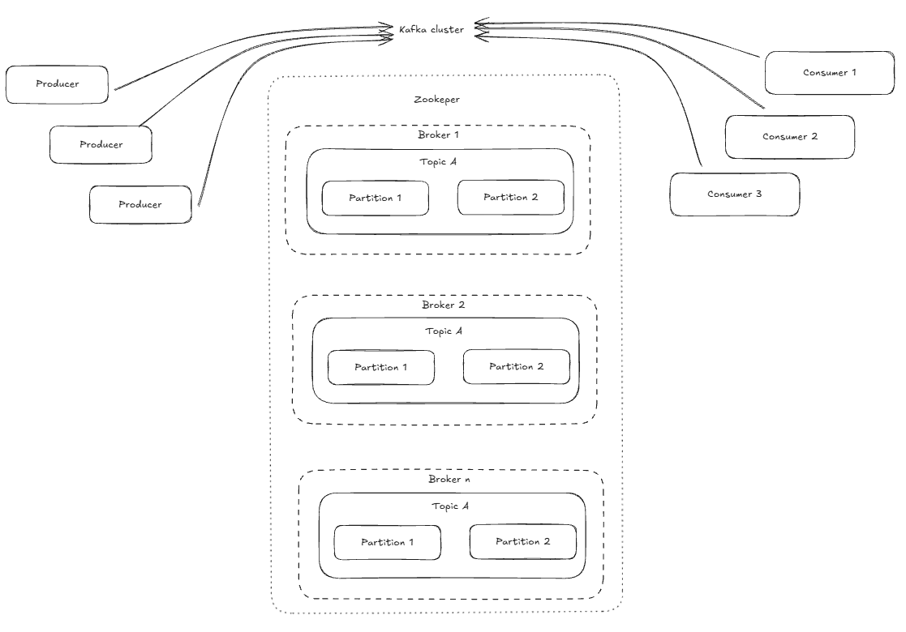

### Kafka Architecture

### Pub Sub System
* in pub sub system producers publish messages to topics and consumers subscribe to those topics to receives the messages.

### Stream Processing Pipelines
* stream processing piplines involve contiuously ingesting, processing and transforming data in real time.

### Log Aggregation Architectures
* log aggregation involves collection log data from various sources, centralising it and making it available for analysis.
kafka's durability and scalability make it an excellent choice for log aggregation systems.

### Core Component of Kafka arhitecture
* ***kafka Cluster*** : a distributed system of multiple kafka brokers that ensures 
fault tolerance, scalability and high availability for real time data streaming.
* ***Brokers*** : Kafka servers that handle data storage and read write operations and manage data replication for reliability.
* ***Topic & Partitions*** :  Data is organised into topics(logical channels), divided into partitions for parallelism and horizontal scalability.
* ***Producers*** : Client Applications that wrtie data to kafka topics, distributing records across partitions.
* ***Consumers*** : application that read data from topics; consumer groups enable load balancing and fault tolerence.
* ***Zookeeper*** : Manages and coordinates kafka brokers, handling configuration, synchronisation and leader election.
* ***Offsets*** : Unique ids for each messages in a partition, used by consumers to track read progress.

### what is kafka broker?
* is a server that hosts kafka partitions and is responsible for managing the storage 
and retrieval of message
* responsibilities 
  * message storage
  * partition management
  * cluster coordination
  * Serving clients : brokers receive requests from producers and consumers.
### topic 
* kafka topic is a logical channel to which producer send message and from which consumer recieve messages.
* characters
  * partiotioning: each kafka topic is devided into partitions.
  * durability 
  * topic name to identify each topic by unique name.
  * Retention policy.

### What is acks configuration? Explain acks=0, acks=1, acks=all
* in kafka the acks configure controls how many borkers must acknowledge a message write before the producer consider it successful
* acks=0 fire and forget (fastest least durable)
  * producer sends the message and imeediately considers the wrtie successful without waiting for any response from the broker
* acks=1 (leader acknowledgment)
  * the producer waits for an acknowledgement from the leader replica only, which confirms it has written teh message to its local log.
* acks=all (all in sync replicas)
  * the producer waits for ack from the leader and all other in sync replicas.
### How does Kafka decide which partition a message goes to?
* Message key : uses hash of the key to ensure all messages with the same key go to the same partition.
* No key : round robin
* custom partitioner : Implement custom Partitioner interface and specify it in their configuration.
* A  producer can explicitly specify the exact partition number hte message should go to when sending the record

### What is batching in Kafka producers?
* messages are grouped into a single request before being sent to the broker.
* it might increase the latency but improves throughput.

### what is idempotent producer in kafka
* is a producer configured to ensure that a message is written to a kafka topic exactly once, even if the proucer retries sending the same msg mulitple times due to network failure.

### What is linger.ms and batch.size?
* linger.ms → “How long to wait” ⏱️
  The producer waits this long to see if more messages arrive before sending.

* batch.size → “How big before send” 📦
  The producer sends once the batch reaches this size.

### How does Kafka distribute partitions among consumers in a group?
* Rebalancing :
  * when consumer joins or leaves a group or topic metadata changes a rebalancing triggered.
  * in the classing protocol one consumer is elected as the group leaded and uses the groups configured partition assignment
  strategy to determine teh distribution of partitions among all members.
  * consumers in gorup use a cofigurable partition.assignment.strategy to decide how partition are distributed.
  * common build in strategy :
    * RangeAssignor
    * RoundRobinAssignor
    * CooperativeStickyAssignor
    * StickyAssignor

### Can two consumers in the same group read from the same partition?
No two consumer in the same kafka consumer gorup cannot read the same partiion

### What happens when a new consumer joins a group?
rebalancing
partition assignment
load balancing

### poll() in kafka
* mechanism used by a consumer to actively fetch bathces of messages from that brokers.
* batch fetching :
  * teh methods return a ConsumerRecords obkect which is a collection of records fetched from all assigned partition
* Timeout mechanism
  * it also takes `timeout` duration as a parameter which is the maximum amount of time the method will block for data if no msg are immediately available.
* offset mgmt : each successfully call to pull() automatically advances the consumer internal position for next fetch.
* heartbeats adn liveness : calling poll() periodically is crucial for the consumers health and group mgmt.

### what happens if a consumer crashes ?
* Heartbeat timeout : kafka detect cosnumer failure after it stop sending heartbeats to the kafka coordinator.
* partition Reassignment : redistribution of partition amoung other active consumer from consumer group.
* Resumption from last offset : new consumer assigned  a partition starts reading from the last committed offset for that partition, effectively picking up where the old one stopped.

### How do you control message reprocessing?
* for consumer (Handling failures / retries)
  * Dont commit offset : avoid commiting the offset so kafka can redeliver msg on the next poll, allowing for retries.
  * dead letter queue (DLq) : for persistent failure , send msg to separate DLQ topic after a set number of retries this prevents poison pills from blocking main queue
  * idempotent consumers: design consumers to handle duplicate message safely so processing doesnot cuase side effect.
### 
