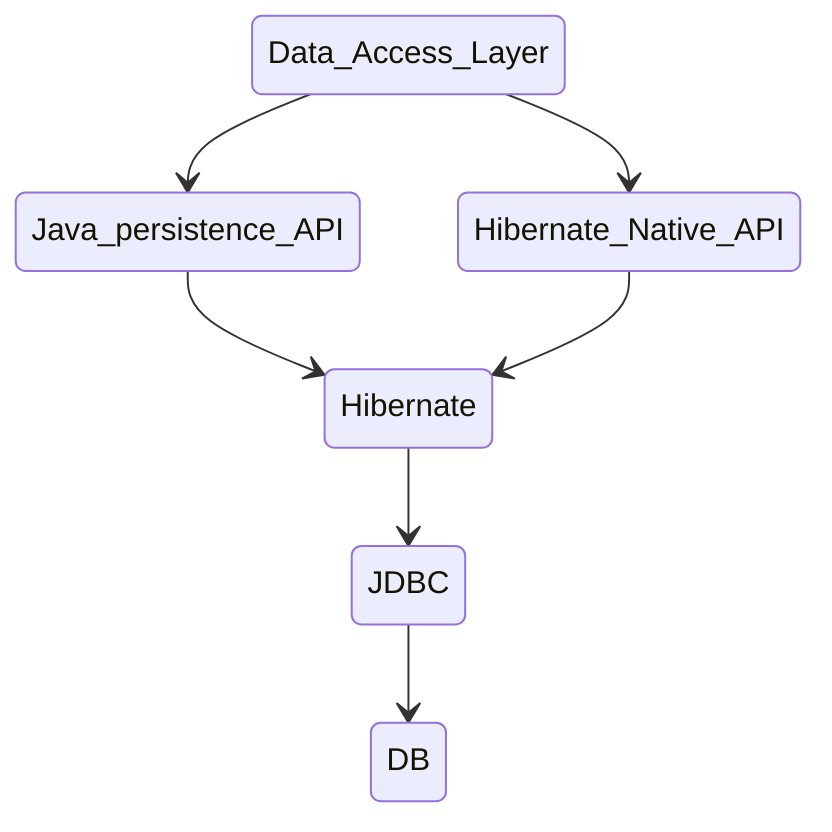

### Review Hibernate and JPA


### Data Access Layer (DAL)
* software layer that separates the logic for accessing and manupulating data from the rest of the applications bussiness logic.
* in Spring boot reht repository clases as data access layer reponsible for database operation.

### Java Persistence API (JPA)
* part of Java EE
* it is only specification not the implementation.
* the jpa defines a standard which features a library must support to be JPA compliant.
* the hibernate is the library which implements all the jpa specification.

### The Hibernate native API 
* sometimes referred to as the hibernate session api allows developers to interact whith database using hibernate specific classes and methods

### JDBC (Java data base connectivity)
* is the most low level way to access databases in java.
* provides standardinse way for java appliction to connect to and manipulate data stored in various DBMS like MySQL.

### Query Writing Methods 

1. Derived queries or query methods (JPA)
   * Derived queries allows developers to define databse queries based on the method names in the repository interface.
   * By following a spacific nameing pattern, spring Data jpa can automatically derive the queries from the method name and parameters.
2. JPQL queries (JPA)
   * Java persistance query language (JPQL) quereis are written using the entity classes their attributes instead of raw SQL queries, making them more type safe and less error prone.
   ```java
   @Repository
    public interface UserRepository extends JpaRepository<User, Long> {
   
       @Query("SELECT u FROM User u WHERE u.username = :username")
       Optional<User> findByUsernameInJpql(String username);
    }
   ```
3. HQL queries
    * HQL is a powerful object-oriented query language used in Hibernate ORM, HQL is superset of the JPQL.
    * JPQL Query is valid HQL query but HQL is not valid JPQL queries.
4. Criteria queries (JPA and Hibernate)
    * criteria queries provide a type safe and object-oriented approach to create queries based on the entity attributes and relationships.
5. Native Queries (JPA and Hibernate)
   * queries allow us to use the database specific sql syntax and features directly in the queries.
   * it is string based and lacks the type safety offered by JPQL. mistakes in the sql syntax or attribute names might only be caught at runtime.
   ```java
   @Repository
    public interface UserRepository extends JpaRepository<User, Long> {
    @Query(nativeQuery = true, value = "SELECT * FROM users u WHERE u.username = :username")
    Optional<User> findByUsernameInNative(String username);
    }
   ```